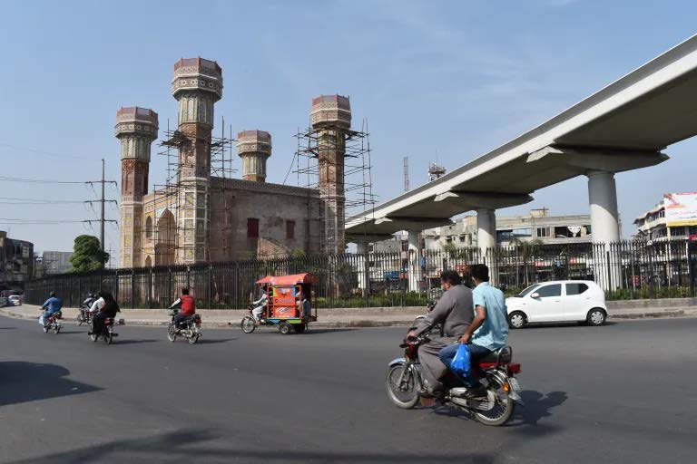

> 格式化整理及翻译：Maker毕

# 一带一路再启动：北京为降低全球基础设施倡议风险的努力

## 第三章：重新设计安全和速度的一带一路

2023年11月

Bradley C. Parks, Ammar A. Malik, Brooke Escobar, Sheng Zhang, Rory Fedorochko, Kyra Solomon, Fei Wang, Lydia Vlasto, Katherine Walsh, and Seth Goodman

第三章：重新设计安全和速度的一带一路

### 第一节：从怀疑者到ESG风险管理的倡导者的北京之旅

在过去的二十年中，北京一直试图将自己定位为一种替代的基础设施融资来源，以供那些不愿与OECD-DAC捐助方或多边开发银行打交道的政府选择。它将自己描述为南南合作的需求驱动型融资方，并默许其外国合作伙伴绕过OECD-DAC捐助方和多边开发银行的规则和标准，通过尽可能少的“繁文缛节”和“麻烦因素”来加快大规模基础设施项目的推进。它提供了快速和灵活的项目准备程序；简化的贷款和拨款批准流程；能够在不需要竞争性招标要求的情况下签订合同；以及较为宽松的环境、社会和治理（ESG）保障措施。[216]

中国的价值主张非常有吸引力。在2000年至2021年间，140个低收入国家和中等收入国家接受了来自北京的8250亿美元的援助和信贷，用于4800个基础设施项目[217]。中国成为发展中国家在大型基础设施项目上的首选银行家，因为它在规模、速度和影响力方面展示了与经合组织发展援助委员会（OECD-DAC）捐助国和多边开发银行（MDBs）相比的三个比较优势。北京为规模庞大的基础设施项目提供资金支持，而其他同行和竞争对手不愿或无法提供[218]。在2000年至2021年间，中国为1385个价值1亿美元或更多的基础设施项目提供了资助和贷款[219]。中国还以闪电般的速度实施砖石项目而闻名：2000年至2021年间，中国政府资助的平均基础设施项目只需2.7年完成[220]。而由世界银行和地区开发银行资助的类似项目通常需要5-10年才能完成（Bulman等，2017; Lagarda等，2018; Duggan等，2020; 世界银行，2023c）[220]。中国的海外发展项目，特别是涉及道路、桥梁、隧道、铁路和港口等基础设施建设的项目，在政治上具有重要意义的时间范围内也产生了显著的经济效益[221]。在对138个低收入国家和中等收入国家的4304个项目进行了为期15年的评估后，Dreher等人（2021）发现，从北京获得资金批准后两年，平均项目使经济增长率提高了0.95个百分点[222]。Bluhm等人（2020）提供了证据，表明中国的互联互通基础设施项目组合在促进空间包容性经济发展方面特别有效，通过将经济活动分散到实施这些项目的省份和地区内[223]。

北京方面以创纪录的速度提供资金并建设大型基础设施项目，对全球南方国家的政策需求产生了改变。通过其“倾听领导者”计划，AidData多次对140个低收入国家和中等收入国家的高级和中层政府官员进行了调查，这些领导者现在表示更倾向于与北京合作而不是与其竞争对手合作进行基础设施项目（Custer等，2021年；Horigoshi等，2022年；Blair等，2022b年）。

然而，中国似乎一夜之间成为全球南方国家的首选基础设施融资方，这一事实非常引人注目。大型基础设施项目通常难以实施。它们经常遇到重大延误和成本超支，并引发对污染、生物多样性损失、附近居民的迁移以及文化遗产保护的担忧[224]。如果设计和实施不慎，它们还可能引发公众抗议、诉讼、劳工罢工、腐败丑闻和政治偏袒的指控[225]。

北京最初试图通过要求政治领导人而不是技术官员提出基础设施项目并监督其实施来克服这些挑战（Dreher等人，2019年，2022年）[226]。它依靠总统、总理及其副手解决可能会延误或破坏项目的复杂和有争议的问题，例如那些被建设活动迫使搬迁或受到伤害的人们的不满和赔偿要求（Dreher等人，2022年）。它还摒弃了许多昂贵而繁琐的西方捐助者和多边开发银行（MDBs）的要求。北京的国有银行要求遵守国家规则和标准，而不是坚持严格遵守国际ESG保障措施（例如国际金融公司关于环境和社会可持续性的绩效标准）（Export-Import Bank of China 2017; Chen and Landry 2018; Baehr等人即将出版）。为了在贷款或拨款申请获得批准后尽快进行快速动员，他们向在地面上有一定存在的中国公司发放了无竞标合同（Bräutigam 2019）[227]。不需要与其他捐助者和贷款机构协调的任何要求或期望消除了实施的额外障碍（Bourguignon and Platteau 2015; Furukawa 2018）。

但是，速度和便利性是有代价的：2000年至2017年间，中国海外基础设施项目组合中至少54%存在重大的环境、社会或治理风险暴露（见附录中的图A38）[228]。在某些情况下，由于对环境和社会影响评估的不足，数十亿美元的公共投资项目被暂停或重新规划（参见Lu等人2023b和Box 3b）。在其他情况下，记者和民间社会组织揭露了中国企业和东道国政府官员串通一气，通过人为抬高建筑项目的单一来源合同价格并分享非法收益（Malik等人2021: 67; Dreher等人2022: 11-12）。在另一些情况下，当地的不满意见没有得到及时或全面的解决，导致声誉风险扩大（我们在第4章中会更详细地分析）[229]。

到早期一带一路时代结束时，北京当局似乎达成共识，维持其旗舰全球基础设施倡议的精英和公众支持需要更有效的ESG风险管理和缓解。变革的第一个迹象出现在2017年11月，当时中国银行业监督管理委员会（CBRC）——该国最高银行监管机构——发布了一套新规定，要求国家开发银行和中国进出口银行采取更强有力的环境和社会风险管理程序（CBRC 2017a，2017b）[230]。到2018年，当局计划从“模糊定义的一带一路1.0过渡到更精细调整的一带一路2.0”（Ang 2019）。2018年8月27日，在一带一路五周年纪念之际，习近平用中国画的比喻呼吁“从写意，用宽笔勾勒轮廓，转向工笔，细致描绘细节”（Ang 2019）。然后，在2019年4月，他在第二届“一带一路”国际合作高峰论坛上发表讲话，宣布中国将“采纳广泛接受的规则和标准，并鼓励参与公司在项目开发、运营、采购、招标和投标方面遵循普遍国际规则和标准”（中华人民共和国外交部2019年）。他在同一讲话中表示，“在推进一带一路合作中，一切都应该以透明的方式进行，对腐败应该零容忍”（中华人民共和国外交部2019年）[231]。

一年后，北京表示初步有兴趣通过与西方和多边发展金融机构共同融资、共同设计和共同实施基础设施项目，并对这些项目加强保障，从而使“一带一路”倡议多边化。它与世界银行、泛美开发银行、亚洲开发银行、欧洲复兴开发银行、欧洲投资银行、国际农业发展基金组织（IFAD）、安地斯发展银行和亚洲基础设施投资银行等八个多边机构合作，成立了一个多边合作中心，名为发展金融多边合作中心（MCDF）。该中心的任务是：（a）投资更多的上游项目准备工作；（b）增强贷款人和借款人有效管理和减轻与债务可持续性、采购、腐败以及环境和社会问题相关的风险的能力；（c）促进中非发展金融机构之间的信息共享和协调（AIIB 2021）。[234]

然后，在2021年，中国大部分国有政策银行、商业银行和投资基金的最终资金来源——外汇管理局（SAFE）宣布，将优先考虑“采用多边开发银行的ESG标准”并“将ESG原则纳入从决策到后期投资管理的整个项目投资过程中”（SAFE 2021: 54）[235]。与此同时，通过一个名为国际可持续金融平台（IPSF）的多边论坛，欧盟和中国启动了一项联合努力，评估各自环境可持续投资分类法的共同点和差异（Moody's Investor Service 2022; IPSF 2022; HKGFA and Guangdong Green Finance Committee 2022）[236]。这种合作导致了所谓的“共同基础分类法”（CGT）的2021年出版，该分类法“被纳入国内法规[在中国]”并“被中国银行直接用作发行国际市场绿色债券的标准”（Cheng and Zhang 2023: 10）。

所有这些行动和言辞承诺表明，北京对更有效地管理其海外基础设施项目组合中的ESG风险有一定程度的兴趣，甚至可能与国际发展金融规则和标准相协调。然而，兴趣并不一定转化为实施，因此我们在本章的目标是确定中国是否从过去的错误中吸取教训，并重新调整其在全球南方地区融资、设计和实施基础设施项目的方式[237]。更具体地说，我们将使用

我们的研究结果表明，尽管中国海外基础设施项目组合的ESG风险状况在“一带一路”前期和早期“一带一路”阶段有所恶化，但在后期“一带一路2.0”阶段出现了改善的迹象。中国的贷款方和捐赠方已经采取了越来越严格的保障措施，这可能最终削弱了G7和多边开发银行在“质量”和“安全”方面与北京竞争的努力。受到强有力的ESG保障措施约束的中国资助和贷款融资的基础设施项目在实施过程中面临的环境、社会和治理风险较少。它们也不太可能被暂停或取消。最重要的是，受到强有力的ESG保障措施约束的中国资助和贷款融资的基础设施项目在实施延迟方面并没有明显的差异。因此，我们的研究结果表明，北京在全球基础设施融资市场上享有比其双边和多边竞争对手意识到的更强的地位。发展中国家已经明确表示他们希望与愿意并能够快速设计和实施大型、高影响力基础设施项目且ESG风险不过高的贷款方和捐赠方合作。北京正在采取积极措施来应对这一挑战。其竞争对手是否会采取相同的措施尚不确定。

### 第二节：衡量中国海外基础设施项目组合的ESG风险暴露的范围和严重程度

我们首先衡量中国海外基础设施项目组合的ESG风险暴露的性质和程度，以及其随时间的变化[239]。我们通过五种方式来进行。首先，我们确定中国是否将大规模基础设施项目定位在环境敏感区域。其次，我们分析中国是否将这些项目安置在社会敏感区域，具体而言，是在土著人口常常被剥夺自由、事先知情同意（FPIC）的地区。第三，我们评估中国是否将大规模基础设施项目定位在易受东道国执政精英政治操纵的地理区域。第四，我们评估中国在海外基础设施项目的实施中是否依赖于因欺诈和腐败行为而受到制裁的承包商。第五，根据AidData的GCDF数据集3.0版本的叙述性证据，我们标记所有已知在实施前、期间或之后出现重大环境、社会或治理挑战的基础设施项目。

图A39展示了2000年至2021年期间位于低收入国家和中等收入国家环境敏感地区的中国援助和贷款资助的基础设施项目的累计数量。我们通过首先将中国官方发展援助（ODA）和其他官方资金（OOF）资助的基础设施项目的地理编码数据与两个独立数据集进行合并来确定给定基础设施项目是否位于一个或多个环境敏感地区：（1）来自世界受保护地数据库（WDPA）的指定陆地和海洋保护区边界，我们将其转换为1 km x 1 km的网格单元栅格；以及（2）国际金融公司第六项绩效标准定义的陆地和海洋关键栖息地的1 km x 1 km网格单元栅格[240]。然后，我们确定了与陆地保护区、海洋保护区、陆地关键栖息地和/或海洋关键栖息地重叠的项目子集[241]。总共，我们发现了108个国家中的1,035个基础设施项目，这些项目得到了来自中国的价值2330亿美元的援助和贷款支持，并位于环境敏感地区[242]。

图A40展示了2000年至2021年期间位于低收入国家和中等收入国家的社会敏感地区的中国援助和贷款资助的基础设施项目的累计数量。我们通过首先将中国官方发展援助（ODA）和其他官方资金（OOF）资助的基础设施项目的精确地理编码数据与一个1公里×1公里的土著土地栅格进行合并，来确定给定基础设施项目是否位于一个或多个这些地区。[243]然后，我们确定那些与土著土地重叠的一个或多个地点的项目子集，这是一个有用的社会风险衡量指标，因为基础设施项目可能通过侵犯土著社区的传统领土而对当地造成伤害，而这并没有得到自由、事先和知情同意（FPIC）。[244]总共，我们发现了547个位于53个国家的社会敏感地区的由中国提供的价值1120亿美元的援助和贷款资助的基础设施项目。[245]

图A41展示了2000年至2021年期间位于低收入国家和中等收入国家的地理区域的中国援助和贷款资助的基础设施项目的累计数量，这些地区容易受到政治控制和操纵的影响。

我们通过首先将中国援助和贷款资助的基础设施项目的精确地理编码数据与《政治领导人隶属数据库》（PLAD）进行合并，来确定给定基础设施项目是否位于这些地区之一。PLAD识别了低收入国家和中等收入国家政治领导人的所在地（出生地）区域（ADM2）。[246]以前的研究表明，中国援助和贷款在分配上存在不均，主要集中在东道国政治领导人的家乡省份和地区，并且中国的贷款人和捐助者缺乏制度保障，以减少政治动机项目获批的可能性（Dreher等，2019年，2022年; Anaxagorou等，2020年）[247]。总共，我们发现在69个国家中有216个基础设施项目，这些项目由中国提供的价值370亿美元的援助和贷款支持，位于容易受到政治控制和操纵的地理区域。[248]

图A42展示了2000年至2021年间，中国资助的基础设施项目中，累计依赖其他国际金融机构制裁的承包商进行欺诈和腐败行为的数据。我们通过三个步骤确定一个基础设施项目是否依赖其他国际金融机构制裁的承包商进行欺诈和腐败行为。首先，我们编制了一个历史上或当前被世界银行和其他五个多边开发银行（MDBs）——非洲开发银行、亚洲开发银行、欧洲重建与发展银行、泛美开发银行和亚洲基础设施投资银行——禁止合作的公司名单，以及每个公司的正式禁止合作期限。然后，我们将被禁止合作的公司名单与参与中国资助的基础设施项目的实施机构和承包商的公司名进行比对。最后，我们通过识别组织的禁止合作期限的开始和结束日期与项目的承诺、实施或完成日期之间的日历天重叠来确定在禁止合作期限内仍然依赖被禁止合作的公司的项目子集。依赖被禁止合作的公司的项目被认为具有重大的治理风险（有关更多详细信息，请参见附录A-6）。总共，我们发现了81个国家的296个基础设施项目，这些项目得到了来自中国的价值888亿美元的资助，并依赖这些公司。

图A43展示了中国资助的基础设施项目中，在实施前、期间或之后出现了重大环境、社会或治理挑战的累计数量。AidData 3.0数据集的一个关键特点是，它与其他公开可用的中国发展金融数据集不同，它包括了“从摇篮到坟墓”的叙述，提供了关于项目如何设计和实施以及为什么失败、出现问题或成功的详细信息。这些叙述包括20985个项目记录中的348万个词（大约相当于34本完整的书中的词数）。它们涵盖了与土地收购、文化遗产和考古遗址保护、土著社区的安置和补偿、空气、水和土壤污染以及遵守反腐败标准相关的项目设计和实施挑战等细节。为了利用这一大量的定性信息，我们采用一套系统的搜索和分类程序（在附录的A-7节中描述）来确定那些在实施前、期间或之后出现了重大环境、社会或治理挑战的基础设施项目的子集。总体而言，我们发现至少有356个基础设施项目在131个国家遇到了重大的环境、社会或治理挑战，这些项目得到了来自中国的2500亿美元的资助和贷款支持。[249]

最后，为了全面了解中国在发展中国家的基础设施项目组合中的ESG风险的范围和严重程度，我们结合使用了这五个指标。为了确定在2000年至2021年间，任何一项由中国提供资助或贷款支持的基础设施项目是否存在重大的环境、社会或治理风险，我们确定其是否位于环境敏感、社会敏感或易受政治控制和操纵的地区；是否依赖于其他国际金融机构制裁的承包商进行欺诈和腐败行为；以及在实施前、期间或后是否遇到重大的环境、社会或治理挑战。在2000年至2021年间的125个低收入国家和中等收入国家中，我们发现由中国提供的4700亿美元的资助和贷款支持的1,693个基础设施项目存在重大的环境、社会或治理风险（见图1.13）。在同样的22年时间内，我们发现中国提供的1,101个基础设施项目的2650亿美元的资助和贷款承诺存在重大的环境风险，而701个基础设施项目的1920亿美元的资助和贷款承诺存在重大的社会风险，405个基础设施项目的2110亿美元的资助和贷款承诺存在重大的治理风险（见图3.1）。

__图3.1__

*注：存在重大环境、社会和治理风险（ESG）暴露是基于项目级综合指标，在第3章第2节中有描述。*

ESG风险普遍率是指中国资助和贷款支持的基础设施项目组合（以2021年不变的美元计量）中存在重大环境、社会或治理风险的年度百分比。随着时间的推移，这一比例有所波动（见图3.2）。在“一带一路”之前的时期，它从2000年的12%急剧增加到2013年的65%。然后在“一带一路”早期期间下降到54%（平均值），在“一带一路”后期期间下降到47%（平均值）。到2021年，它下降到33%。

__图3.2__

注：项目记录的年份是它们从中国获得财务承诺的年份，尽管它们遇到的ESG风险可能在财务承诺年份之后发生。存在重大ESG风险暴露是基于项目级综合指标，该指标在第3章第2节中进行了描述。同样，环境风险暴露、社会风险暴露和治理风险暴露是基于项目级综合指标，该指标在第3章第2节中进行了描述。

在图3.3、3.4和3.5中，我们分别追踪环境风险普遍率、社会风险普遍率和治理风险普遍率[254]。在整个分析期（2000年至2021年）中，环境风险普遍率（27%）平均高于社会风险普遍率（20%）或治理风险普遍率（18%）[255]。在这三个指标中，可以看到一个普遍一致的模式：风险普遍率在“一带一路”前期（2000年至2013年）大多增加，在“一带一路”期间（2014年至2021年）大多减少。一些最大的下降可观察到在“一带一路”后期（2018年至2021年）[256]。然而，这些下降应该谨慎解释，因为它们可能是由于(a)新批准的项目尚未进入ESG风险通常显现的项目生命周期阶段，(b)中国海外基础设施项目组合的ESG风险概况实际改善，或者(c)这些因素的某种组合[257]。

__图3.3__

*注：项目记录在它们从中国获得财务承诺的年份，尽管它们遇到的ESG风险可能在财务承诺年份之后显现。显著环境风险暴露的存在基于一个在第3章第2节中描述的项目级综合指标。*

__图3.4__

*注：项目记录在它们从中国获得财务承诺的年份，尽管它们遇到的ESG风险可能在财务承诺年份之后显现。显著社会风险暴露的存在基于一个在第3章第2节中描述的项目级综合指标。*

__图3.5__

*注：项目记录的是它们从中国获得财务承诺的年份，尽管它们遇到的环境、社会和治理风险可能在财务承诺年份之后出现。存在重大治理风险暴露的依据是一个项目级的综合指标，该指标在第3章的第2节中有描述。*

表A12提供了2000年至2021年中国资助和贷款资助的基础设施项目的数量和货币价值的国家级摘要统计数据，这些项目存在重大的环境、社会和治理风险。它还提供了同一时期内整体ESG风险普遍率的国家级分解。从表A12的国家级数据分析可以看出，中国海外基础设施项目组合的ESG风险在某些地区存在不成比例的集中（见表A10）。例如，2000年至2021年间，仅有16.9%的中国资助和贷款资助的基础设施项目组合（以2021年不变美元计量）位于南美和中美洲，但在同一时期，该地区的ESG风险集中占到了其组合的38%[258]。北京海外基础设施项目组合的ESG风险也在不同人均收入水平的国家之间分布不均（见表A11）。治理风险再次是一个例子。2000年至2021年间，37.1%的中国资助和贷款资助的基础设施项目组合（以2021年不变美元计量）位于中高收入国家（UMICs）[259]。然而，令人震惊的是，52.5%的该组合的治理风险集中在这些国家[260]。表A12提供了证据，表明少数大型援助和信贷接受国，包括委内瑞拉、马来西亚和阿根廷，导致了中高收入国家治理风险暴露的不成比例集中。

在图3.6中，我们通过将中国援助和贷款资助的基础设施项目的环境、社会和治理风险暴露数据与点、多边形和线矢量数据（在第1章中描述）相结合，确定了全球热点区域。这些矢量数据捕捉了这些项目的地理足迹。为此，我们首先创建了一个覆盖AidData的GCDF数据集中每个低收入国家和中等收入国家的200 km x 200 km网格[261]。然后，我们使用点、多边形和线矢量数据将每个地理编码的基础设施项目分配给其中一个或多个网格单元。然后，我们根据2000年至2021年间中国援助和贷款资助的基础设施项目在该地理区域的环境、社会或治理风险暴露的累积货币价值，为每个网格单元分配一种颜色渐变，沿着“热”光谱[262]。浅粉色网格单元表示中国在其基础设施项目组合中风险暴露水平相对较低的地区，深紫色网格单元表示中国在其基础设施项目组合中风险暴露水平相对较高的地区。

图3.6左上角的地图显示，北京在热带安第斯地区（包括委内瑞拉、厄瓜多尔和秘鲁）、南锥地区（包括阿根廷）、东非地区（包括埃塞俄比亚、肯尼亚和乌干达）、西非地区（包括加纳、多哥、贝宁、尼日利亚和喀麦隆）、中亚地区（包括哈萨克斯坦、吉尔吉斯斯坦和塔吉克斯坦）以及东南亚地区（包括老挝、柬埔寨、越南和印度尼西亚）都面临着特别高的环境风险暴露水平。地理分布上的社会风险暴露，如图3.6右上角的地图所示，虽然中亚地区的热点区域较少集中，但在埃塞俄比亚、肯尼亚、巴基斯坦和东南亚地区集中程度更高。图3.6左下角的地图还显示，北京在热带安第斯地区、东非地区和南亚地区（包括赞比亚、孟加拉国和阿根廷）的治理风险暴露水平特别高（这三个国家在第4章中提供了深入的案例研究证据）。

最后，在图3.6右下角，我们将所有三类风险暴露合并为一张地图，每个网格单元都反映了中国在该地区的基础设施项目在环境、社会和政府风险方面遇到的重大风险程度。

__图3.6__

**中国在低收入国家和中等收入国家的基础设施项目组合中存在重大环境、社会和治理（ESG）风险暴露的全球地图**

*注：该地图展示了中国以赠款和贷款方式资助的基础设施项目组合在环境、社会或治理（ESG）风险暴露方面具有显著影响的地理区域。较深（紫色）的颜色表示该组合在风险暴露方面具有较高水平，较浅（粉色）的颜色表示该组合在风险暴露方面具有较低水平。环境风险暴露、社会风险暴露和治理风险暴露是基于项目级综合指标进行评估的，具体描述请参见第3章第2节。*

### 第三节：利用新的合同证据衡量中国基础设施项目组合中ESG保障的严格程度

尽管北京在海外基础设施项目组合中明显面临着各种ESG风险，但我们对于其采取的保障措施以及如何管理和减轻这些风险知之甚少。另一个盲点是中国国有贷款机构是否在不断加强或削弱其ESG保障措施。

AidData的GCDF数据集3.0版本为填补这一证据空白提供了独特的机会[263]。作为支持数据集构建的初级来源识别工作的一部分，AidData通过官方渠道获得了大量未经编辑的基础设施融资协议，包括低收入国家和中等收入国家的政府登记和公报、援助和债务信息管理系统以及议会监督机构。

这些授予和贷款协议代表了“高价值来源”，因为它们提供了详细的信息，即在签署协议与东道国合作伙伴时，融资方是否确定了与ESG风险管理相关的行为期望，并提供了监测和强制执行这些期望的机制。

AidData的GCDF数据集3.0版本的另一个重要特点，也是对2.0版本的改进，是它使这些未经编辑的协议对于北京在发展中国家资助基础设施项目所使用的全范围金融工具都可用，包括：

1. 中国商务部（MOFCOM）发放的双边援助和无息贷款
2. 中国进出口银行发放的双边贷款
3. 中国国家开发银行（CDB）发放的双边贷款
4. 中国工商银行、中国建设银行和中国银行等国有商业银行发放的双边贷款
5. 中国政策性银行（中国进出口银行和CDB）和国有商业银行发放的联合贷款
6. 中国国有银行和多边机构发放的联合贷款
7. 中国通过多边机构渠道提供的援助和贷款
8. 中国国有企业发放的供应商信贷

这八种融资协议占据了中国在2000年至2021年间在发展中国家的90%的援助和贷款资助的基础设施项目组合，其中包括各种不同的ESG条款和条件（见表A5和A8）[264]。然而，迄今为止，关于协议类型之间法定ESG保障严格程度的差异还没有得到系统记录。以及以往的研究也没有证明北京在使用这些不同类型的协议时，随着时间的推移，法定ESG保障严格程度的变化情况。

为了克服这些障碍，我们制定了一套标准化的与ESG风险管理相关的编码标准，可应用于支持海外基础设施项目的任何类型的中国贷款合同或援助协议[265]。这26个标准在附录的A-8节和表A3中描述，其中包括8个关注环境保护的标准，7个关注社会保障的标准，以及11个关注治理保障的标准。它们与经济合作与发展组织（OECD）关于官方支持出口信贷和环境社会尽职调查的共同方法的理事会建议、国际金融公司（IFC）关于环境和社会可持续性的绩效标准、预防和打击欺诈和腐败的统一框架、OECD关于贿赂和官方支持出口信贷的理事会建议，以及OECD关于公共采购的理事会建议基本一致[266]。这些标准分为三组：（1）确定与ESG风险管理和缓解相关的行为期望的规则或标准的存在或缺失，（2）监督机制以监测对这些行为期望的遵守情况，以及/或（3）制裁不遵守这些行为期望的执行机制（例如，赔偿、暂停拨款）。

为了构建我们的编码样本，我们首先确定了3.0版本的GCDF数据集中包含未编辑的贷款合同和赠款协议的所有记录（近300条）。然后，我们删除了不支持基础设施项目的所有贷款合同和赠款协议。随后，我们消除了所有不对应8种主要基础设施融资协议类型之一的贷款合同和赠款协议。如A-10节所示，我们然后修剪剩余的贷款合同和赠款协议样本，以确定每个8个金融工具类别的3个协议[267]，这些协议提供广泛的地理覆盖范围（包括非洲、拉丁美洲和加勒比海、亚洲和太平洋地区、中东欧和中东地区）和收入等级覆盖范围（包括中高收入国家、中低收入国家、低收入国家和最不发达国家），以及时间范围（在我们的22年研究期间）。对于每个金融工具类别，我们还寻求确定在BRI后期之前和之后发布的协议[268]，因为自2017年末以来，北京已经作出了许多加强ESG保护的言辞承诺。

虽然我们没有通过随机抽样程序选择基础设施融资协议进行编码，我们的编码样本代表了中国在低收入国家和中等收入国家的资助和贷款融资基础设施项目组合的一小部分，我们的发现表明，基础设施融资工具的ESG条款和条件高度标准化，这使我们相信我们捕捉到了北京用于资助海外基础设施项目的主要金融工具之间在法定ESG保障严格性方面的有意义差异[269]。我们还发现，不同地区和收入档次的国家之间的ESG条款和条件变化相对较小（见附录中的表A4）[270]。在这方面，我们的发现与首次系统评估中国与海外借款人签订贷款合同的条款和条件的研究一致。Gelpern等人（2022: 16）得出结论：“我们对100份合同的分析表明，中国的贷款条款在贷款人和工具方面高度标准化，并且在地区或收入档次方面没有显著变化”。

我们在附录的表A8中提供了我们编码样本的合同级数据。为了将合同级数据转化为每种金融工具类型的保障严格性的分类指标，我们首先对每种金融工具类型（在“一带一路”后期之前或之后）是否建立了与ESG风险管理和缓解相关的行为预期的（a）规则或标准，（b）监督机制以监测遵守这些行为预期，或（c）制裁不遵守这些行为预期的执行机制进行二元决定。根据这些决定，我们在表A8中报告的情况下，我们使用以下标准为每种金融工具类型分配高、中、低的环境、社会和治理保障评级：

- 低：不存在规则和标准，也没有监测遵守或制裁不遵守的机制。
- 中：存在规则和标准，但没有监测遵守或制裁不遵守的机制。
- 高：存在监测遵守和/或制裁不遵守的机制。

我们对样本中的授予和贷款协议应用标准化编码标准，得出了8个金融工具类别在两个时间段内的ESG摘要评级：BRI前期和早期（2000-2017年）以及BRI后期（2018-2021年）[271]。这些摘要评级以法定而非实际意义上的ESG保障强度为衡量标准，详见表3.1，并引起了一些重要的模式和趋势的关注[272]。首先，在北京可支配的基础设施融资工具中，政策性银行（中国进出口银行和国家开发银行）的贷款协议提供的ESG保障最弱[273]。在BRI启动之前，这一点无疑是正确的，并且在早期和后期的BRI期间基本上仍然如此[274]。其次，中国的国有商业银行在其海外贷款协议中具有强有力的法定ESG保障。他们不仅在签署双边贷款协议时应用这些保障，而且在参与银团贷款协议时也如此。第三，中国人民银行和中国财政部通过多边机构向低收入国家和中等收入国家提供的授予和贷款以及涉及多边机构的银团贷款都具有强有力的ESG保障。这也适用于涉及多边机构的银团贷款，这突出了表3.1的第四（更广泛的）发现：银团贷款的法定ESG保障始终比双边贷款更强。考虑到银团贷款协议中的所有参与方都必须同意一套共同的合同条款和条件，包括适用的ESG保障，人们可能会认为“最低公共分母”动态可能会生效。但是表3.1表明相反是正确的：银团参与者似乎会遵循对ESG风险缓解偏好最强的贷款机构[275]。

__表3.1__

#### 根据融资工具类型，中国海外基础设施投资的法定ESG保障严格程度

| 融资工具 | 环境保障 |  | 社会保障 |  | 治理保障 |  |
| --- | --- | --- | --- | --- | --- | --- |
|  | 早期/前一带一路 | 后期/后一带一路 | 早期/前一带一路 | 后期/后一带一路 | 早期/前一带一路 | 后期/后一带一路 |
| 双边中国进出口银行贷款 | 低 | 低 | 低 | 低 | 低 | 低 |
| 双边中国发展银行贷款 | 低 | 低 | 低 | 低 | 中等 | 中等 |
| 双边中国商务部贷款或援助 | 低 | 中等 | 低 | 中等 | 低 | 高 |
| 双边中国国有商业银行贷款 | 高 | 高 | 高 | 低 | 高 | 高 |
| 与中国和多边银行参与的联合贷款 | 高 | 高 | 高 | 高 | 高 | 高 |

*注：每种授予和贷款工具的保障严格程度分数基于附录A-9中描述的分析。*

我们研究期间（2000-2021）发生了几个变化，值得讨论。MOFCOM在BRI晚期之前的赠款和无息贷款协议中的ESG保障措施较弱。然而，我们发现MOFCOM在2018年至2021年间转向更强的法定ESG保护的证据。同样的模式也出现在中国国有企业发行的供应商信贷协议中：正式的ESG保障严格性随时间的推移而增加[276]。表3.1还提供了证据，表明在BRI晚期，中国国有商业银行削弱了其社会保障措施[277]。在BRI前期和早期，这些金融机构已经建立了机制来监督遵守国内和国际社会法律和标准[278]，或要求借款人在遵守社会法律和标准的情况下进行财务补偿（赔偿）以弥补实际或被指控的违反社会法律和标准所造成的损失或责任。然而，出于我们尚不了解的原因，这些保障在BRI晚期消失了。

我们分析的下一步是将表3.1中的ESG保障严格性评级应用于中国在发展中国家的整个基础设施项目组合中的赠款和贷款。我们首先将3.0版本的GCDF数据集中的所有活动、已完成、暂停或取消的基础设施项目的贷款和赠款映射到8个金融工具类别中的一个（如果可能的话）。然后，我们将表3.1中报告的综合ESG保障严格性评级分配给使用相同贷款或赠款工具的3.0版本GCDF数据集中的基础设施贷款和赠款[279]。

__图3.7__

*注：每个授予和贷款工具的保障严格程度评级基于附录的表3.1和A-9节中解释。*

图3.7展示了2000年至2021年间中国援助和贷款资助的基础设施项目组合中，低收入国家和中等收入国家（LIC和MIC）中具备强制性环境、社会和治理保障的估计百分比。可以看到，在“一带一路”后期（2018-2021年）出现了明显的向更强的ESG保护的转变。到“一带一路”项目实施的第八个完整年（2021年），中国在LIC和MIC中援助和贷款资助的基础设施项目组合中约有57%具备强制性环境、社会和治理保障[280]。这代表了与过去实践的重大分离：在世纪之交时，中国在LIC和MIC中援助和贷款资助的基础设施项目组合中没有强制性环境、社会和治理保障。

__图3.8.1：环境__

__图3.8.2：社会__

__图3.8.3：治理__

*注：每个授予和贷款工具的保障严格程度评级基于附录的表3.1和A-9节中解释。*

然而，在“一带一路”后期，北京并未表现出对所有类型的ESG保障措施同等热情。图3.8显示，从2018年到2021年，37%的基础设施项目组合受到了强制性的法定环境保障措施的约束，而在之前的18年（2000年至2017年）期间，这一比例为20%。同样，从2018年到2021年，40%的基础设施项目组合受到了强制性的法定治理保障措施的约束，而在之前的18年（2000年至2017年）期间，这一比例为20%。

然而，在“一带一路”后期，北京对其海外基础设施项目组合应用严格的社会保障措施的兴趣明显较低。在2018年至2021年期间，它对其由赠款和贷款资助的基础设施项目组合进行了越来越多的保护，以免受这些类型的保障措施的约束（见图3.8）。虽然在“一带一路”后期，这种变化的直接解释是中国国有商业银行的贷款合同中取消了社会保障执行机制（见表3.1），但其发生的根本原因仍然是个谜。一个可能性是，中国对强制性的法定社会保障措施的厌恶与其在上世纪90年代末和本世纪初与世界银行的社会保障措施的不愉快经历有关（见3a框）。[281]

---

#### 方框3a：中国在青海西部扶贫项目中应用世界银行社会保障政策的经验

1997年，世界银行开始与中国青海省政府合作，设计了一项价值4000万美元的西部扶贫项目贷款。该项目的目的是将大约6万名贫困农民安置到一个新的灌溉区。安置区位于青海中部，距离西藏自治区边境500多公里。然而，1999年，一个跨国倡导网络（包括西藏非政府组织，如西藏信息网和国际西藏运动，以及多边发展银行监察机构，如银行信息中心和国际环境法中心）发起了一场运动，阻止世界银行董事会批准该项目。他们声称，在美国国会和美国财政部的支持下，批准该项目等于资助种族灭绝（通过将6万名中国少数民族与藏族文化混合）。他们还声称，世界银行未能遵守自己的社会保障政策，将该项目分类为“B类”而不是“A类”。[282]

1999年6月，董事会有条件地批准了该项目，一群活动人士在世界银行总部外悬挂了一条“世界银行批准中国在西藏的种族灭绝”横幅。罗伯特·韦德（Robert Wade）代表世界银行的检查小组调查了有关该项目的指控，他回忆道：“非政府组织（NGOs）建立了一个强大而有效的运动网络。他们建立了网站，以分享信息并提供样本抗议信给银行，这些信可以直接从网站发送电子邮件或打印出来传真。西藏游说团赞助了世界各地的摇滚音乐会，现场备有明信片、传真机和电子邮件设施。结果是银行从未见过的大量信件、明信片、电子邮件和传真，主要来自美国和欧洲。西方媒体，包括报纸和电视，都站在批评者一边。像《金融时报》、《纽约时报》和《华盛顿邮报》等主要报纸的报道几乎与非政府组织的传单一样。他们用相同的语言重复了非政府组织对该项目的描述，通常没有区分非政府组织声称的事实和他们自己作为记者所报道的事实。例如，许多报道作为事实报道，搬迁区是达赖喇嘛的出生地，这是完全错误的[...]。然而，尽管他们声称代表藏人，并对咨询过程表示谴责，但非政府组织从未提供证据证明当地人不希望该项目，除了一些非常简短和匿名的信件被声称住在搬迁区附近的人发送给西藏非政府组织”（韦德2009年：32）。

2000年7月，世界银行董事会召开会议，决定是否批准该项目。讨论持续了多天，发展中国家代表主张批准该项目，而某些发达国家代表呼吁取消该项目。最终，当中国的执行董事撤回该项目提案时，问题得以解决。北京宣布该项目将继续进行，但资金来源将改为其他途径。

---

当然，北京的批评者和竞争对手可能会质疑，如果没有实施ESG保障措施，中国海外基础设施融资协议中的任何“细则”是否重要。为了评估中国实际应用ESG保障措施是否与其融资协议中的法定ESG保障措施相匹配，我们利用AidData收集的关于项目设计和实施的详细定性信息。GCDF数据集3.0版本中的“从摇篮到坟墓”的叙述包括在项目实施前、期间和后期努力减轻ESG风险的详细描述，例如通过采用响应环境影响评估结果和建议的环境管理计划（EMPs）或向项目受影响人员（PAPs）提供财务补偿等。

为了有效利用这些定性信息，我们使用一套系统的搜索和分类程序（在附录的A-7部分中描述）来确定基础设施项目的子集，这些项目有证据表明中国金融机构或实施机构在项目实施前、期间或后期采取了减轻环境、社会或治理风险的努力。在2000年至2021年期间，我们发现有证据表明中国在66个低收入和中等收入国家支持的至少210个基础设施项目中采取了实际的ESG风险缓解措施，这些项目得到了中国的赠款和贷款支持[283]。中国通过实际的ESG风险缓解措施支持的赠款和贷款融资基础设施项目组合的累计价值从2000年的5500万美元增加到2021年的860亿美元（见图A48）。

根据图3.9，中国在发展中国家支持的基础设施项目中，通过事实上的ESG风险缓解措施的比例从2000年的2%稳步增加到2021年的18%，这与中国在同一二十二年期间逐渐增加使用明确的ESG保障措施的趋势基本一致[284]。然而，图3.9还突出了随着时间推移发生的重要变化：尽管在“一带一路”时代（2014-2021）之前（2000-2013），明确和事实上的风险缓解措施大多是同步进行的，但在“一带一路”时代，明确和事实上的风险缓解措施之间的“差距”扩大了[285]。到2021年，北京在原则上应用ESG保障措施的基础设施项目组合中，有57%受益于明确的ESG保障措施，然而只有18%的证据表明实际上进行了ESG风险缓解措施（另见3b框）[286]。

__图3.9__

*注：事实上的ESG风险缓解措施的衡量方法在附录A-8中描述。明确的ESG保障措施在附录A-9中定义。*

---

#### Box 3b: 法定与事实上对拉合尔橙线地铁项目的ESG保障的应用

拉合尔橙线是巴基斯坦首个城市大规模轨道交通项目。自2020年10月启用以来，该27公里地铁线的日均乘客量（178,714人）一直低于容量，但改变了这个大都市的公共交通格局（Hasnain 2023）。在习近平主席2015年4月访问巴基斯坦期间，该项目被纳入中巴经济走廊（CPEC）作为“中国的礼物”（Khan 2018）。但最终该项目由中国进出口银行提供资金，包括优惠买方信贷12亿美元，利率为2%；人民币12亿政府优惠贷款，利率为2%；以及2.03亿美元买方信贷贷款，利率为5.2%[287]。巴基斯坦政府使用贷款收入部分资助了中国国家铁路集团有限公司（CR）和中国北方工业公司（NORINCO）合资企业CR-NORINCO与旁遮普大众交通局之间的16.3亿美元商业合同。CR-NORINCO随后聘请了当地承包商协助进行各种活动，包括项目的环境影响评估（EIA），该评估由当地国有工程服务公司NESPAK在2015年8月开工前进行（NESPAK 2015b）。

NESPAK的“全面而完整”的研究包括环境影响评估（EIA）和一个37页的环境管理计划（EMP），第三方评估者认为这些研究“符合国际规范和标准”（NESPAK v. Mumtaz 2017）。EMP确定并提出了一系列与土地征用和移民、植物和动物、空气质量和噪音水平、公共设施、地震危险以及工人的健康和安全有关的风险，并提出了相应的纠正措施（NESPAK 2015a）。在认识到根据1975年古迹法（“法案”）的定义，几个文化遗产地将受到建设的影响后，NESPAK确认了“尽可能避免对文化遗产地和公共财产的任何干扰”的需要（NESPAK 2015b）。它指出，增加的噪音水平可能会影响文化遗产地的结构完整性，要求承包商在建设期间采用“隔音屏障”（NESPAK 2015a）。尽管法案禁止在文化遗产地200英尺范围内进行建设活动，但根据这些计划，考古学总监于2015年11月发出了“允许在受保护的古迹200英尺禁区内进行建设”的无异议证书（Mumtaz v. Punjab 2016）。

*这是拉合尔标志性的17世纪纪念碑Chauburji，由莫卧儿帝国皇帝沙贾汗为他心爱的女儿贾哈纳拉·贝古姆建造，是一个皇家花园的入口，照片中可以看到橙线背景。这是该项目建设活动影响的11个文化遗产地之一。*

__*照片来源：*__*Anam Hussain/AlJazeera*

当时，根据当地法律的所有环境和社会要求似乎已经得到满足，CR-NORINCO及其当地分包商获得了继续实施的许可。然而，当施工队在2015年10月开始标记拆迁和土方工程的地点时，当地社区和民间社会团体意识到，“建设工作将在Shalimar花园以及其他几个文化遗产地点的95英尺范围内进行”（Ghani 2015）。几乎立即，一群知名的环境律师、城市规划师和权利倡导者向拉合尔高等法院（LHC）提交请愿书，声称发放NOC“不仅是武断的、恶意的、明显非法的，没有合法授权，而且没有独立思考的应用”（Mumtaz v. Punjab 2016）。在发放NOC之前，考古学总监据称没有考虑巴基斯坦对文化遗产保护的国际公约承诺，并受到政府的压力“在两天时间内发放NOC，没有咨询任何独立专家”（Mumtaz v. Punjab 2016）。

在政府未能对这些关切提供令人满意的回应后，2016年1月，LHC下令立即暂停在11个文化遗产地附近的项目活动。它还要求当局报告他们对土地收购、噪音水平和固体废物管理的所有法定要求的遵守情况（Shaukat和Tanveer 2016）。法院的命令使省政府陷入狂乱，因为它预料到长时间的实施延迟可能会阻止该项目在2018年7月选举之前完工。它立即聘请专家进行独立的结构和遗产影响评估（SIA和HIA），并于2016年7月重新发布了NOC，然后LHC在随后的一个月发表了完整的裁决。当巴基斯坦最高法院（SCP）以同样的理由拒绝政府的修订NOC时，这个问题最终由SCP解决，质疑政府明显试图消除这个障碍的行为的诚信。

经过几次额外的听证会和与国际专家的接触，以确定振动对历史建筑完整性的真正危险，SCP最终在2017年12月批准了项目的恢复，条件是必须实施其31项强制性要求（NESPAK v. Mumtaz 2017）。几天之内，“谢巴兹速度”全面展示，经过将近两年的延迟，这些地点周围的建设重新开始[288]。尽管有这些努力，夏里夫政府未能在任期结束时完成该项目，最终让巴基斯坦正义运动党的主要政治对手在2020年10月剪彩。

这个项目在“一带一路”早期阶段的经历表明，即使有强有力的法定环境、社会和治理（ESG）保障措施，由于各种原因，这些保障措施的实际执行可能会出现问题或失败。在某些情况下，地方官员可能会被激励以速度为重，而不是以安全为重。在其他情况下，他们可能缺乏技术知识来执行标准，或者对不遵守规定不担心受到处罚。

---

根据现有证据，我们可以得出以下结论：首先，中国的捐助者和贷款方越来越普遍地在与低收入国家和中等收入国家的基础设施融资协议中包含环境、社会和治理（ESG）保障条款。这些条款与国际上的ESG保障措施基本相符，例如经济合作与发展组织（OECD）关于官方支持出口信贷和环境社会尽职调查的共同方法的理事会建议、国际金融公司（IFC）的环境和社会可持续性绩效标准、预防和打击欺诈和腐败的统一框架、OECD关于贿赂和官方支持出口信贷的理事会建议，以及OECD关于公共采购的理事会建议。其次，许多这些法定条款远远超出了与ESG风险管理相关的规则和标准的确定；中国海外基础设施项目组合中，越来越大比例的项目受到包括监测合规性和/或制裁不符合ESG规则和标准的机制在内的融资协议的支持。第三，中国的实际风险缓解措施正在增加。第四，在原则上（法定）和实践上（实际）应用于中国海外基础设施项目的ESG保障措施之间存在日益扩大的差距，这是可以预料的，因为ESG风险缓解只是最近成为北京的优先事项。

### 第四节：ESG保障措施是否会产生项目绩效的回报或惩罚？

考虑到北京最近采取了重要措施来减轻其海外基础设施项目组合中的ESG风险，一个重要问题是这些调整是否与中国以速度和便利性著称的声誉相符。中国之所以成为全球南方国家的首选大额基础设施融资银行，并非偶然。它通过解决低收入国家和中等收入国家未满足需求的关键问题——基础设施融资不需要过于复杂和繁琐的ESG保障政策和程序（Dollar 2016; Swedlund 2017; Parks 2019; Humphrey and Michaelowa 2019; Zeitz 2021; Horigoshi et al. 2022）来获得这一地位。[289]

2015年，G-24（一个由发展中国家共同合作，协调在国际货币和金融问题上的立场的国家组成的组织）在一份名为《发展中国家的基础设施融资》的报告中表达了低收入国家和中等收入国家的不满之声：

> 世界银行和主要地区多边开发银行的商业实践之一对基础设施投资产生了特别强烈的影响，这就是环境和社会保障政策。保障措施包括对不同类型的贷款操作的程序和限制，旨在“保护”项目不对环境和社会群体产生负面影响。保障措施最早在1990年代在世界银行首次实施，其他主要地区多边开发银行在随后的几年也纷纷效仿。世界银行的保障措施仍被认为是最全面和严格的，但亚洲开发银行、美洲开发银行和非洲开发银行的保障措施在这些年逐渐加强，使得它们之间的差异相对较小，尤其是在环境评估和移民安置等热点问题上。在项目经历初步筛选过程时，多边开发银行的工作人员会确定它是否触发了任何适用的保障措施。如果是这样，必须遵循一系列特殊要求，才能批准和拨款贷款。在世界银行的情况下，最常触发的保障措施与环境评估和非自愿移民有关，最常影响到交通、能源和城市等投资项目。所需的程序非常详细和具体，对借款人甚至工作人员来说往往非常难以理解。要求通常包括由第三方专家（通常由政府承担费用）进行耗时长的研究、与受影响方进行长时间的磋商（有时包括非选举的非政府组织）、广泛的缓解措施，以及长时间的强制性事先公开披露和意见征询期，在此期间项目无法继续推进。这些要求超越了借款国可能实施的任何国家法律，这对许多借款国来说是一个特别令人困扰的原则问题，远超过保护措施的实际影响（Humphrey 2015）。

中国是G-24的成员国，也是世界银行最大的借款国，对这些关切表示赞赏（见第3a框），并将其作为区别于全球基础设施融资市场的方式。在“南南合作”的旗帜下，中国强调与全球南方团结一致，并向低收入国家和中等收入国家提供了一种优先考虑快速建设“硬件”而非关注政策和机构的“软件”投资的发展模式[290]。北京的信息产生了共鸣，以至于中国成为发展中国家在高速公路、铁路、水坝、桥梁、海港、机场、电厂和电网方面的首选融资方，而多边开发银行由于借款需求不足而缩减了其基础设施部门和项目[291]。几年前，苏默斯理工大学发展合作中心的克里斯·汉弗莱和苏默斯大学的卡塔琳娜·迈克洛瓦发表了对三个非洲国家的采访证据，探讨了借款需求对基础设施融资的变化性质。他们发现：

> “所有三个国家的官员都提到，限制他们从世界银行和非洲开发银行申请基础设施贷款的一个问题是这些类型项目隐含的‘麻烦因素’，包括项目设计规则以及环保和社会保护措施。所有政府的官员都一致认为世界银行特别困难。一位埃塞俄比亚官员说：‘对于水电和铁路，我们甚至不和他们交谈，我们直接找中国人。' 讨论一个重大的天然气管道项目时，一位坦桑尼亚官员说：‘中国人可能会贵一些，但他们在这种项目上更容易，更快。我们甚至没有向世界银行申请支持，我们直接找的中国人。' 即使在只有少量中国资金的马拉维，官员们也在计划中的新的由中国以市场利率资助的煤电厂项目上体验到了这些动态。‘世界银行和非洲开发银行不会资助它，因为强大的股东出于环保原因不会同意这种事情。所以我们选择了中国人。’” (Humphrey 和 Michaelowa 2019: 23)

鉴于低收入国家（LIC）和中等收入国家（MIC）对“麻烦因素”的需求较低，北京转向更严格的环境、社会和治理（ESG）保障制度，引发了一个问题，即这是否会削弱其在全球基础设施融资市场上与竞争对手区别开来的价值主张。为了更好地了解中国贷款人和捐助者采用更强的ESG保障所带来的影响，我们使用AidData的GCDF数据集的3.0版本，比较了有和没有强有力的ESG保障的中国政府资助的基础设施项目的表现。我们使用六个结果指标进行比较：（1）项目延期的百分比，（2）实施延期的平均长度，（3）完成延期的平均长度，（4）完成所需的平均时间，（5）项目暂停和取消的频率和价值，以及（6）ESG风险的普遍程度。

我们首先比较了有和没有强制性ESG保障的中国基础设施项目组合中延期的百分比。如果一个项目的实际实施开始日期比原定实施开始日期晚了3个月或更长时间，和/或者实际完成日期比原定完成日期晚了3个月（或更长时间），我们将其分类为“延期”。图A58显示，当强制性ESG保障措施存在时，中国在低收入国家和中等收入国家的捐助和贷款资助的基础设施项目与没有强制性ESG保障措施时一样容易延期：74%的有强制性ESG保障的基础设施项目延期，而75%的没有强制性ESG保障的基础设施项目延期。

接下来，我们将研究中国海外基础设施项目在不同严格程度的环境、社会和治理（ESG）保障下的平均开工延迟时间。图A59提供了证据，表明在强有力的ESG保障下进行的中国海外基础设施项目的开工延迟时间略短（平均比没有强有力保障的项目少47天）。基础设施项目在强有力的ESG保障下比没有这种保障的项目更快启动的事实与俗语“预防胜于治疗”是一致的。这也意味着北京可能能够在不失去竞争优势的情况下实施强有力的ESG保障。一般来说，受多边开发银行（MDB）资助的基础设施项目在强有力的ESG保障下面临着更长的开工延迟。全球发展中心的查尔斯·肯尼估计，“A类”世界银行项目（环境和社会敏感项目）从提案阶段到支付（项目开工）阶段平均需要7.4年（2,689天）。[292]

“一分预防胜过十分治疗”的原则显然也适用于中国援助和贷款资助的海外基础设施项目的完工延迟。图A60提供了证据，表明当强有力的环境、社会和治理（ESG）保障措施得以实施时，中国海外基础设施项目的完工延迟略有缩短（平均比没有强有力ESG保障措施的项目少91天）[293]。AidData的GCDF数据库3.0版本的另一个相关发现是，没有强有力ESG保障措施的基础设施项目平均需要3.2年（1,163天）完成，而有强有力ESG保障措施的基础设施项目则少用8天（1,155天）完成（见图A61）[294]。这些发现并不意味着中国在速度方面的声誉受到威胁。

那么，我们可以得出关于具有和没有强有力ESG保障措施的基础设施项目之间“实施速度”的差异的结论是什么？最重要的一点是，这些差异并不大，这意味着没有太多证据支持ESG保障措施会对项目绩效造成重大影响的观点。传统智慧认为，ESG风险缓解措施会严重阻碍基础设施项目的实施，从而削弱了中国在全球基础设施融资市场上与竞争对手区别开来的关键价值主张（Swedlund 2017; Parks 2019; Humphrey and Michaelowa 2019; Zeitz 2021）。然而，我们的发现并不支持这一观点。相反，它们表明，如果中国愿意接受稍长的项目实施时间（以几十天而不是几百或几千天为单位），中国可以降低其海外基础设施投资组合的ESG风险水平[295]。

北京海外基础设施项目组合的表现可能因ESG保障力度的不同而有所差异的另一个潜在方式是项目暂停或取消的可能性。AidData的最新版本GCDF数据集显示，具有强制性ESG保障的基础设施项目在中国援助或贷款协议最终确定后，受到暂停或取消的风险要小得多。根据图3.10，自2000年以来，具有弱制性ESG保障的74个中国援助和贷款资助的基础设施项目（价值430亿美元）已经被暂停或取消，而具有强制性ESG保障的7个中国政府援助和贷款资助的基础设施项目（价值110亿美元）自2000年以来被暂停或取消。[296] 这些发现表明，应用更严格的ESG保障可能有助于而不是阻碍北京在发展中国家降低海外基础设施项目组合风险的努力。

__图3.10__

*注：强制性和弱制性ESG保障的定义见附录A-9。*

最后，我们可以使用AidData的GCDF数据集3.0版本来确定中国海外基础设施项目组合中ESG风险普遍率是否根据ESG保障力度而有所不同。图3.11比较了具有强制性和没有强制性ESG保障的中国援助和贷款资助的基础设施项目组合中面临重大ESG风险的百分比。缺乏强制性ESG保障的项目中，82%面临重大ESG风险，而具有此类保障的项目只有18%遇到类似风险。[297] 附录中的图A53、A54和A55证明这些模式同样适用于ESG保障的三种类型（环境、社会和治理）。

*注：强制和弱制的法定环境、社会和治理（ESG）保障在附录A-9中有定义。重要的ESG风险暴露的存在是基于项目层面的综合指标，该指标在第3章第2节中有描述。*

### 第五节：解读北京的ESG风险缓解策略

在本章的剩余部分，我们将分析AidData的GCDF数据集的3.0版本，以更好地了解北京是如何在其基础设施项目组合中管理和缓解ESG风险的。我们看到中国国有金融机构采取了四项ESG风险缓解措施：

1. 削减具有最薄弱保障措施的双边发展金融机构的资金支持
2. 支持具有最强保障措施的双边贷款机构和捐助机构
3. 通过联合融资和多边化外包风险管理
4. 解除与高风险国家的关系，并加强与低风险国家的关系

#### 风险缓解策略1：削减保障措施最薄弱的双边发展金融机构的资金

北京方面关于降低其海外基础设施项目组合风险的大部分官方声明和出版物都很平淡，难以解读。中国商务部和生态环境部于2021年7月发布的《对外投资合作绿色发展指南》指出，“[t]对外投资合作绿色化必须以习近平新时代中国特色社会主义思想为指导，贯彻党的十九大精神和党的十九届二中、三中、四中、五中全会精神，贯彻习近平生态文明思想，贯彻党中央、国务院决策部署，坚持新发展理念，强化绿色发展意识，高效利用资源，严格环境保护，有效控制碳排放，展示中国在全球绿色转型中的领导地位，展示我们建设世界更好更清洁的地方的决心，为新发展格局打下基础”（商务部和生态环境部，2021年）。

然而，当你通过追踪资金流向来剖析中国政治家和官僚们使用的花言巧语时，一个严峻的现实浮现出来：北京正在将其海外基础设施项目组合中越来越少的比例委托给国家政策性银行（中国国家开发银行和中国进出口银行），这两家银行在法定环境、社会和治理（ESG）保障方面特别薄弱（见表3.1和表3.2）。图3.12绘制了随时间变化的两个趋势：中国通过政策性银行提供的受助和贷款资助的基础设施项目中，具有薄弱的法定ESG保障的比例以及中国基础设施项目组合中通过政策性银行提供的双边贷款的比例从2000年到2021年的变化情况。北京对低收入国家和中等收入国家基础设施项目的政策性银行融资从2013年的86%下降到2021年的41%[298]。在此期间发生的年度变化也与中国海外基础设施项目组合中由具有薄弱法定ESG保障的机构提供资金的年度变化非常密切相关（见图3.12）。

__图3.12__

*注：薄弱的法定ESG保障在附录A-9中有定义。*

__表3.2__

##### 中国按融资工具类型划分的海外援助和贷款基础设施项目组合随时间变化的情况

| 合同类别 | 前“一带一路”时期（2000-2013年） | 早期“一带一路”时期（2014-2017年） | 晚期“一带一路”时期（2018-2021年） |
| --- | --- | --- | --- |
| 双边中国进出口银行贷款 | 38.06% | 43.84% | 48.75% |
| 双边国家开发银行贷款 | 39.79% | 23.93% | 11.61% |
| 双边商务部贷款或援助 | 2.64% | 2.68% | 3.10% |
| 双边中国国有商业银行贷款 | 5.14% | 9.38% | 8.84% |
| 与中国和多边银行参与的联合贷款 | 0.80% | 2.17% | 1.45% |
| 与中国国有商业银行和/或政策性银行参与的联合贷款 | 8.86% | 16.91% | 20.39% |
| 通过多边机构渠道的中国人民银行/财政部援助或贷款 | 0% | 0.12% | 0.89% |
| 来自中国国有企业的供应商信贷 | 4.71% | 0.77% | 4.97% |
| 总计 | 100% | 100% | 100% |

*注：该表格展示了以8种金融工具类别划分的中国在低收入国家和中等收入国家通过援助和贷款融资的基础设施项目组合的份额（以2021年不变的美元计量），涵盖了三个不同的时间段：（1）2000年至2013年的“一带一路”前期，（2）2014年至2017年的早期“一带一路”时期，以及（3）2018年至2021年的晚期“一带一路”时期。*

#### 风险缓解策略2：支持具有最强保障措施的双边贷款人和捐助方

在北京拥有用于资助发展中国家基础设施项目的各种双边工具中，国家开发银行（CDB）和中国进出口银行贷款的正式环境、社会和治理（ESG）保障措施最弱。北京方面越来越多地转向一组不同的金融机构，这些机构提供的贷款和捐赠工具包括一套更严格的正式ESG保障措施，用于资助低收入国家和中等收入国家的基础设施项目。

在第3节的第3章中，我们发现，中国国有商业银行的双边贷款、中国国有企业的供应商信贷以及中国商务部的赠款和无息贷款的正式ESG保障措施比国家开发银行和中国进出口银行的贷款更强（见第2章的表2.1）。这一发现引发了一个问题：北京是否增加了对这些双边基础设施融资工具的使用？上述表3.2显示，事实上确实如此，尽管增长方式是逐步的：在“一带一路”前期（2000-2013年），通过这些工具资助的中国基础设施项目组合在低收入国家和中等收入国家的比例为12.49%，在“一带一路”早期（2014-2017年）为12.83%，而在“一带一路”后期则增至16.91%。

#### 风险缓解策略3：通过联合和多边化外包风险管理

北京可以采取的另一种策略是将海外基础设施项目组合的风险管理外包给多边机构，这些机构被广泛认为是ESG保障设计和实施的行业领导者和规范制定者（Park 2010; Martin et al. 2015; Buntaine 2016; Brauneder et al. 2018; Buchanan et al. 2018; Narain et al. 2020, 2022）。

多边化的一种途径是直接委托管理赠款和贷款给一个政府间组织。例如，通过其在非洲开发银行的20亿美元信托基金（称为非洲共同成长基金）和在美洲开发银行的20亿美元信托基金（称为中国与拉美和加勒比地区共融基金），中国人民银行已完全委托项目设计、准备、实施和监督责任（包括ESG保障申请）给多边机构。

另一种多边化选择是参与由多边机构安排的联合贷款协议。其中许多协议采用A/B结构，即多边开发银行（MDB）充当贷款记录人，并保留一部分贷款作为自己的账户（“A贷款”），同时将剩余贷款的参与权出售给其他方（“B贷款”）。与多边安排方的A/B联合贷款协议的一个共同特点是，所有B贷款参与方在风险缓解目的上都服从于A贷款提供方的权威（Esty and Megginson 2003; Bae and Goyal 2009; Hainz and Kleimer 2012; Broccolini et al. 2021; Lu et al. 2023a）。

根据上面的表3.2，北京方面逐渐增加了对多边机构的依赖。中国在低收入国家和中等收入国家的基础设施项目组合中，通过多边参与者提供的银团贷款和中国人民银行/财政部委托给多边机构的贷款和赠款的比例，从“一带一路”前期（2000-2013年）的0.8%增加到“一带一路”后期（2018-2021年）的2.34%。尽管增长幅度较小，但值得注意的是，我们样本中委托给多边机构和中国银行和多边机构参与的银团贷款以及中国人民银行和财政部委托给多边机构的贷款和赠款，在基础设施融资协议中具有最严格的环境、社会和治理（ESG）保障（见第3节的表3.1）。

如果银团贷款中的中国政策银行和国有商业银行参与者与多边参与者的银团贷款类似，那么如果银团的所有成员普遍遵循对环境、社会和治理风险缓解偏好最强的贷款机构，那么这种情况是一致的。与此期望一致，上面的表3.1提供了证据，表明国有商业银行的环境、社会和治理保障确实优于政策银行在银团贷款安排中的保障。[299]

北京还加大了对这些双边基础设施融资工具的使用。图3.13显示了2000年至2021年期间，中国以赠款和贷款方式资助的基础设施项目中，具有强制性法定环境、社会和治理（ESG）保障的百分比，以及通过中国政策银行和国有商业银行参与的贷款银团方式资助的中国基础设施项目组合的百分比。北京在低收入国家和中等收入国家的基础设施项目中使用这些贷款银团安排的比例大幅增加，从2000年的0%增加到2021年的41%，并与强制性法定环境、社会和治理（ESG）保障的使用情况相一致[300]。这二十二年期间的年度变化与中国海外基础设施项目组合中由具有强制性法定环境、社会和治理（ESG）保障的机构资助的百分比的年度变化密切相关。

__图3.13__

*注：强制性法定环境、社会和治理（ESG）保障的定义详见附录A-9。*

#### 风险缓解策略4：解除与高风险国家的关系，并加强与低风险国家的关系

降低基础设施项目组合的ESG风险配置还有一种方法，就是利用有关东道国过去表现的信息来指导未来的贷款和赠款活动。也就是说，一旦捐赠方或贷款方确定了其投资组合中存在重大ESG风险的基础设施项目的子集，它可以寻求确定这些项目在地理上的集中程度，以便能够确定存在特别高ESG风险水平的东道国，并将未来基础设施项目的资金重新分配到其他地方。亚洲开发银行和世界银行等几家主要多边开发银行都采取了这种重新分配或“选择性”做法（Buntaine 2011, 2015, 2016）。

__图3.14__

*注：该图比较了中国对低收入国家和中等收入国家的基础设施融资在两个时间段内分配给高ESG风险普遍率国家的整体百分比：（1）BRI前期和早期（2000-2017）和（2）BRI后期（2018-2021）。高ESG风险普遍率国家被定义为在2000年至2017年间，中国至少75%的赠款和贷款资助的基础设施项目面临重大ESG风险的国家。重大ESG风险暴露的存在是基于一个项目级综合指标，该指标在第3章的第2节中有描述。*

为了评估北京在后期“一带一路”时代是否朝这个方向发展，我们首先创建了两个东道国的群体：2000年至2017年期间至少75%的中国援助和贷款资助的基础设施项目组合在ESG风险方面具有重要风险敞口的国家，以及2000年至2017年期间中国援助和贷款资助的基础设施项目组合在ESG风险方面具有较低风险敞口的国家。然后我们比较了北京在2018年至2021年期间向这两个群体提供的基础设施融资。图3.14显示，在后期“一带一路”时代，北京提供的基础设施融资中有2.8%流向了9个低收入国家和中等收入国家，这些国家在2000年至2017年期间至少75%的中国援助和贷款资助的基础设施项目组合在ESG风险方面具有重要风险敞口。相比之下，北京在2000年至2017年期间将更大比例（6.83%）的援助和贷款资助的基础设施项目组合分配给了同样的9个国家。

这一模式与北京调整援助和信贷的跨国分配以减少海外基础设施项目组合的ESG风险特征的想法是一致的。

考虑到中国在其项目面临特别高的ESG风险暴露的国家中削减了基础设施支出，它可以通过增加对项目面临特别低的ESG风险暴露的国家的基础设施项目支持来重新调整其投资组合。图3.15提供了证据表明，北京实际上已经朝这个方向迈出了步伐。更具体地说，它表明在后BRI时期（2018-2021年），中国有7.6%的基础设施融资流向了6个低于2000年至2017年期间中国资助的基础设施项目面临重大ESG风险暴露的低收入国家和中等收入国家（LICs和MICs）。这在低风险国家的后BRI时期支出中代表了一个显著增加，因为北京在2000年至2017年期间只将其资助的基础设施项目组合的1.73%分配给了同样的6个国家。

__图3.15__

*注：此图比较了中国对低收入国家和中等收入国家的基础设施融资的整体百分比，这些融资分配给了在两个时间段内ESG风险普遍率较低的国家：（1）前BRI和早期BRI时期（2000-2017年）和（2）后BRI时期（2018-2021年）。ESG风险普遍率较低的国家被定义为在2000年至2017年期间中国资助的基础设施项目组合中面临重大ESG风险的项目不超过10%的国家。重大ESG风险暴露的存在基于一个在第3章第2节中描述的项目级综合指标。*

### 第六节：北京是在纠正错误还是在示好？

当北京首次表示有意将其海外基础设施项目组合纳入更严格的ESG保障措施时，批评者和竞争对手迅速质疑其诚意。战略与国际问题研究中心（CSIS）的乔纳森·E·希尔曼撰写了一篇专栏文章，他认为中国正在进行“绿色洗白”。他写道，“习近平知道中国在环境问题上很脆弱。在去年的一次世界领导人聚会上，‘绿色’和‘可持续’是他关于下一阶段“一带一路”倡议的演讲中的关键词。为了应对批评，中国推出了不少于11项新的“一带一路”绿色倡议，所有这些倡议都是自愿的，没有任何约束力或透明度”（希尔曼2020b）。塔夫茨大学的凯利·西姆斯·加拉格尔和齐琪写道，“中国政府关于绿色“一带一路”的言辞值得称赞，但它尚未采取任何实质性的改变来实现这一目标”（西姆斯·加拉格尔和齐琪2021）。美国及其盟友也否认北京的海外基础设施项目具备强有力的ESG保护措施。2019年11月，美国、日本和澳大利亚宣布联手建立“蓝点网络”，该网络将“根据公认的原则和标准评估和认证被提名的基础设施项目”，并“促进市场驱动、透明和财务可持续的印太地区和全球基础设施发展”。最近，美国、英国和G7的其他成员推动了全球基础设施和投资伙伴关系（PGII）——此前被称为“重建更美好世界”（B3W）倡议——他们将其描述为“一带一路”倡议的替代方案，并为希望严格按照国际公认的ESG保障措施进行基础设施项目的国家提供了一个选择。[301]

然而，本章通过许多新的来源和证据表明，北京并不仅仅是在进行国际虚伪的行为。它已经采取了有意义的措施，通过减少缺乏强有力的ESG风险管理防护措施的银行的国际借贷活动，增加通过具有强有力的ESG保障机制的机构提供基础设施融资，逐步解除与ESG风险水平较高的低收入和中等收入国家的援助和信贷关系，并将新的基础设施融资转向风险较低的国家。与此同时，它在从ESG怀疑者转变为倡导者的道路上仍处于相对早期阶段，可能需要很多年甚至几十年才能弥合法律和实际应用ESG保障措施之间的差距[302]。

我们没有看到中国的发展金融机构普遍遵守国际ESG保障措施的证据。相反，我们看到一些中国的贷款人和捐赠者正在逐步和有选择地将他们的ESG保障政策和实践与传统捐赠者和贷款人的政策和实践进行协调[303]。这些变化应该让北京在全球基础设施融资市场上的竞争对手停下脚步。G7和一些多边开发银行目前正在努力说服发展中国家的潜在合作伙伴，即（a）“一带一路”是一个低质量的基础设施选择（偏重速度和便利性而不是安全性和长期可持续性），以及（b）他们可以为那些希望根据“国际最佳实践”ESG保障措施严格执行基础设施项目的国家提供替代的高质量融资选择。

然而，这种黑白分明的品牌策略可能与其目标受众缺乏共鸣，因为低收入国家和中等收入国家已经非常明确地表示，他们对“黄金标准”环境、社会和治理（ESG）保障的需求水平很低。他们希望能够快速设计和实施大规模、高影响力的基础设施项目，而不会面临不合理的ESG风险[304]。本章的证据表明，北京可能比其竞争对手意识到的更能满足这一需求。它正在提供越来越具有强大ESG保障的大规模基础设施项目，而不会像由G7成员和多边开发银行支持的类似项目那样面临长时间的实施延迟。

## 注释

216 与此同时，北京拒绝了几乎所有遵循国际发展金融规则和准则的邀请，并批评西方捐助国和多边借款人的“一刀切”政策（Malik等，2021年；Dreher等，2022年）。

217 这些数字仅涉及正在进行和已完成的项目。在2000年至2021年期间，北京还为49个低收入国家和中等收入国家的94个基础设施项目发放了总值为560亿美元的拨款和贷款，后来这些项目被暂停或取消。

218 中国在最终敲定大型基础设施项目的贷款协议方面比竞争对手更快。2008年，塞内加尔时任总统阿卜杜拉耶·瓦德在《金融时报》上写道：“通过直接援助、信贷额度和合理的合同，中国帮助非洲国家以创纪录的速度建设基础设施项目。……我发现，与世界银行讨论、谈判和签署需要五年的合同相比，当我们与中国政府打交道时，只需要三个月”（瓦德，2008年）。

219 在2000年至2021年期间，北京为89个低收入国家和中等收入国家的至少250个基础设施项目提供了总额至少为250亿美元的拨款和贷款，为68个低收入国家和中等收入国家的至少377个基础设施项目提供了总额至少为500亿美元的拨款和贷款，为47个低收入国家和中等收入国家的至少163个基础设施项目提供了总额至少为100亿美元的拨款和贷款。所有这些数字都包括从中国获得拨款或贷款承诺的基础设施项目，后来这些项目被暂停或取消。

220 使用AidData的GCDF数据集的3.0版本，我们通过测量实际项目实施开始日期和实际项目完成日期之间的平均日历天数，计算完成中国资助的基础设施项目所需的平均时间。我们的分析仅包括获得中国官方承诺的正在进行和已完成的项目。

221 这一发现意味着，如果一个东道国选择接受三个额外的中国援助或财政支持的发展项目，可以合理地预期在北京同意资助这些项目后的两年内，其经济（GDP）增长将提高2.85个百分点。有关中国援助和贷款支持的发展项目的社会经济影响的更多信息，请参见Bluhm等人（2020年）、Martorano等人（2020年）、Dreher等人（2022年）、Mandon和Woldemichael（2023年）以及Wellner等人（即将出版，2023年）。

222 具体而言，Dreher等人（2021a）发现，每增加一个中国援助或财政支持的项目，经济增长平均可提高0.41至1.49个百分点（pp），在项目资金获批后两年。0.95 pp代表了这一范围的中点。

223 Bluhm等人（2020年）发现，平均而言，中国援助和财政支持的连接基础设施项目将经济集中度（通过特定次国级地区内所有9.3平方公里网格单元的夜间光输出的基尼系数来衡量）降低了约2.2个百分点。他们还提供了证据表明，这些项目有效地将经济产出从城市中心等密集区域重新分配到其直接周边地区（即近郊和郊区）。连接基础设施的安装可以通过使企业更容易进入更远的市场和个人通勤或迁居到工作地点，加速空间包容性经济发展。它还可以降低消费品和投入品的成本，促进新业务的发展，增加土地价值，提高农业产量，并促进知识和技术溢出。

224 关于按时按预算实施这些类型的项目的困难性，请参见Flyvbjerg等人（2002年）。

225 在这一点上，请参阅Isaksson和Kotsadam（2018a，2018b），Isaksson（2020），Dreher等人（2019, 2022），Anaxagorou等人（2020），Iacoella等人（2021）和Baehr等人（即将出版）。

226 中国的需求驱动的项目选择系统也鼓励东道国政治家与中国承包商之间的勾结。正如张和史密斯（2017: 2335）解释的那样，“中国公司和东道国政府建立了一种非正式联盟，中国公司说服东道国政府与中国提出新的援助项目，而承包商则承诺在幕后帮助获得融资。这些项目是根据当地政治家的政治需求和中国承包商的商业策略进行逆向设计的。”同样，Bräutigam（2019）认为，“中国银行融资模式的致命弱点在于它严重依赖中国公司与东道国官员共同开发项目。这为回扣和项目成本的虚高创造了强烈的动机。特别是在选举年，公司和公共工程部长可能会勾结以获得项目批准。”

227 在中国国家开发银行和中国进出口银行的大多数海外贷款协议中，单一采购是常规而非例外。事实上，这些协议几乎总是涉及与特定中国公司的特定商业合同，并且严格要求借款人专门使用贷款的收益来为在贷款协议中提及的预选商业合同提供融资（Gelpern等人，2021, 2022）。

228 这个数字代表了中国在2000年至2017年期间以恒定的2021年美元计量的基础设施项目组合中累积的具有重大环境、社会或治理风险敞口的比例。根据图3.2定义的平均年度ESG风险普遍率，在2000年至2017年期间为47%。在2000年至2017年期间，由中国提供的对低收入国家和中等收入国家的基础设施项目共1,403个，价值3830亿美元（以恒定的2021年美元计量），存在重大的环境、社会或治理风险（见图1.13）。

229 这些问题中的许多可能本可以通过各种机制避免：进行环境和社会影响评估，以确保给予土著人民自由、事先和知情的同意（FPIC），避免在濒危栖息地附近设立项目；竞争性招标规则，以确保物有所值；黑名单程序，以避免雇佣有参与腐败和串通行为记录的承包商；以及申诉机制，以便更容易识别和回应当地利益相关者的关切（Parks 2019；Dreher等，2022）。

230 2018年，北京还资助了一个中国-国际货币基金组织能力建设中心，培训政府官员关于低收入国家的债务可持续性框架（DSFs）和其他与“一带一路”相关的政策问题（Morris等，2020）。

231 2021年1月，中国发展银行（CDB）前董事长胡怀邦因受贿1300万美元被判处无期徒刑。然后，2021年9月，CDB副行长何兴祥因“严重违纪违法”被中国中央纪律检查委员会（CCDI）调查。一年后，中国进出口银行北京分行前行长李力因腐败指控被开除党籍。然后，2023年3月，中国银行董事长刘亮辞去职务，CCDI对他涉嫌腐败和贪污展开调查。

232 有证据表明，国际金融机构（IFI）的领导人试图引导中国朝这个方向发展（例如，金墉2017年；拉加德2019年）。

233 建立MCDF的谅解备忘录可以通过https://www.ndb.int/wp-content/uploads/2022/11/MCDF-MOU-for-disclosure.pdf完整获取。

234 MCDF由亚洲基础设施投资银行（AIIB）管理，自称为“一个多边倡议，旨在根据国际金融机构（IFI）的标准增加对发展中国家的高质量基础设施和连通性投资，同时鼓励其他投资者和金融机构采纳这些标准”（AIIB 2021年）。

235 2021年9月，习近平在联合国大会上宣布中国将不再为海外新建燃煤发电项目提供资金支持。然后，在2022年3月，国家发展和改革委员会、外交部、商务部和生态环境部发布了《关于共同推进“一带一路”绿色发展的意见》，明确表示中国将“停止在海外新建燃煤发电项目，并审慎推进正在建设中的项目”。

236 IPSF是一个多边论坛，旨在促进可持续金融相关事务的经验交流和国际合作。其成员包括欧盟、中国、新加坡、日本和印度。

237 2022年2月，海外发展研究所（ODI）的陈云南告诉《欧洲货币杂志》说，“中国似乎有一种更具体和有针对性的方法。其金融机构正在学习，认识到过去的错误，采取更加风险规避的方式来决定他们资助哪些项目，以及他们如何进行融资和尽职调查”。

238 关于这一点，请参见Humphrey 2015年；Dollar 2016年；Swedlund 2017年；Humphrey和Michaelowa 2019年；Zeitz 2021年；Horigoshi等2022年；以及Blair等2022b年。

239 我们的分析不仅包括正在进行和已完成的基础设施项目，还包括暂停和取消的项目。我们包括暂停和取消的项目是为了避免样本选择偏差，因为这类项目更有可能存在重大的环境、社会和治理风险。

240 Martin等人（2015年）；Brauneder等人（2018年）；以及联合国环境规划署和国际自然保护联盟（2023年）。国际金融公司的第六项绩效标准（PS6）被国际债权人和捐助方广泛使用，用于确定“关键栖息地”，这些栖息地指的是具有高生物多样性价值的地区（Narain等人，2020年，2022年）。

241 更具体地说，我们确定了所有与陆地或海洋保护区或“可能”关键栖息地（根据PS6定义）在2000年至2021年任何时间点上有物理重叠的中国政府资助和贷款融资的基础设施项目。我们排除了所有没有“精确”或“近似”地理编码的项目。具有“精确”地理编码的项目是指其地理要素的边界非常精确的项目。具有“近似”地理编码的项目是指在项目地理要素的精确边界范围内5公里半径范围内确定的项目。因此，所有编码到ADM8、ADM7、ADM6、ADM5、ADM4、ADM3、ADM2、ADM1和ADM0级别的项目都被排除在外。

242 环保人士对中国政府资助的基础设施项目的选址在地理区域上引发了特别关注，这些区域可能促进合法和非法的木材采伐、农业边界扩张以及人类定居点在以前偏远或原始地区的建设（Laurance等人，2015年；Yang等人，2021年；Baehr等人，2022年）。

243 Garnett等人（2018年）。

244 自由、事先知情和知情同意（FPIC）是指原住民族在任何时候都有权对影响其领土的发展项目提供或拒绝同意。这是联合国原住民权利宣言（UNDRIP）赋予原住民族的权利，其基础是“所有人民都有自决权”的原则。UNDRIP要求各国“诚实守信地与相关的原住民族通过他们自己的代表机构进行磋商和合作，以获得他们的自由、事先知情和知情同意，然后再采取和实施可能影响他们的立法或行政措施”。

245 决定将基础设施项目定位在原住民社区的传统领土内部还是外部，只是了解此类项目社会风险概况的一种方式。与现有文献一致，我们关注这一社会风险维度，因为它可以在几乎所有基础设施项目的地理空间和时间上进行一致的测量（例如，Yang等，2021）。

246 PLAD提供了1989年至2021年间来自177个国家的1,109位有效政治领导人的出生地信息（Bomprezzi等，2023）。出生地被地理编码到ADM2（区）级别。为了确定容易受到政治控制和操纵的项目，我们确定了所有位于在这些领导人任职期间中国提供资助或贷款承诺的家乡（出生）地区（ADM2）的项目。

247 世界银行使用前期成本效益分析来筛选候选项目。它采用了一个简单的项目可接受性规则——“项目净收益的预期现值必须高于或等于互斥项目替代品的预期净现值”，作为“防止项目选择被狭隘的政治或部分利益所控制”的保障（Warner 2010: 2）。相比之下，中国的援助和贷款机构没有类似的制度保障（Dreher et al. 2019, 2022）。

248 一个重要的限制是，我们只将位于政治领导人所在地区（ADM2）的项目视为容易受到政治控制和操纵的地理区域。因此，位于政治领导人所在地区（ADM1），但不在政治领导人所在地区（ADM2）的项目被排除在外。我们也不考虑非基础设施项目在政治领导人所在地区（ADM2）的存在。

249 “至少”这个限定词很重要，因为我们无法解决可能影响我们基于关键词搜索的度量的“假阴性”问题（请参见附录中的A-7部分）。

250 我们将搜索范围限制在价值2000万美元（以2021年不变的美元计）或更多的援助和贷款支持的基础设施项目上。受到更大财务承诺支持的项目通常具有更详细的项目描述，这为识别环境、社会和治理风险提供了更强的基础。它们也更不容易产生“假阴性”。251 中国援助和贷款支持的基础设施项目可能会面临多种类型的环境、社会和治理风险。

252 当追踪受到ESG风险影响的中国援助和贷款资助的基础设施项目数量时，可以观察到类似的模式。2020年和2021年受ESG风险影响的基础设施项目数量明显减少（见图A44），但考虑到ESG风险的发生和检测概率随项目从财务承诺阶段到实施阶段和完成阶段的推进而增加，我们认为2020年和2021年的明显减少应该谨慎解读。

253 如果将ESG风险普遍率重新定义为中国援助和贷款资助的基础设施项目中面临重大环境、社会或治理风险的年度百分比，从2000年的25%上升到2013年的40%。然后在早期“一带一路”阶段平均降至36%，在后期“一带一路”阶段平均降至31%（见图A44）。

254 在图3.3、3.4和3.5中，我们将风险普遍率定义为中国援助和贷款资助的基础设施项目组合（以2021年不变的美元计量）中面临特定类型风险的年度百分比。在图A45、A46和A47中，我们将风险普遍率重新定义为中国援助和贷款资助的基础设施项目中面临特定类型风险的年度百分比。

255 如果将ESG风险普遍率重新定义为中国援助和贷款资助的基础设施项目中具有重大环境、社会或治理风险暴露的年度百分比，同样的模式存在：环境风险普遍率明显高于社会风险普遍率（22%）或治理风险普遍率（7%）。

256 在“一带一路”后期，中国资助和贷款支持的具有重大环境风险、社会风险和治理风险的基础设施项目的总数也明显下降（见图3.3、3.4和3.5）。

257 鉴于环境、社会和治理风险在基础设施项目从财务承诺阶段到实施阶段和完成阶段的过程中被发现的概率增加，另一个可能性是“一带一路”后期环境、社会和治理风险普遍性下降的表现可能是由于测量不准确。

258 表A10显示，环境风险主要集中在中东欧地区：2000年至2021年期间，中国资助和贷款支持的基础设施项目组合（以2021年不变美元计）中，有13%位于该地区，而具有重大环境风险的项目组合中，有20.5%集中在中东欧地区。相比之下，社会风险主要集中在亚洲：2000年至2021年期间，中国资助和贷款支持的基础设施项目组合（以2021年不变美元计）中，有36.4%位于该地区，而具有重大社会风险的项目组合中，有42.3%集中在亚洲（见表A10）。

259 根据表A11，中等偏下收入国家（LMICs）和低收入国家（LICs）在2000年至2021年期间分别接收了中国资助和贷款支持的基础设施项目组合的26.8%和25.3%（以2021年不变美元计）。然而，在2000年至2021年期间，具有重大社会风险的项目组合中，有35.8%集中在LMICs，37.8%集中在LICs。

260 仅有15.8%的中国援助和贷款资助的基础设施项目组合（以2021年不变的美元计量）具有重大社会风险暴露，25.6%具有重大环境风险暴露，并且位于中等收入国家（见表A11）。

261 如果一个项目跨越多个网格单元，我们假设项目的承诺货币价值在项目的线或多边形内均匀分布。因此，项目的总财务承诺价值将根据项目面积在每个网格单元内所占比例进行分割。

262 在图A62中，我们复制了图3.6，但根据中国援助和贷款资助的基础设施项目的累计数量，而不是相同项目的中国援助和贷款承诺的累计货币价值，来衡量给定网格单元的风险暴露程度。

263 GCDF数据集的3.0版本提供了数百个未经编辑的援助、贷款、债务豁免、债务重组和托管账户协议的稳定URL。AidData在2021年3月首次发布《中国如何借贷》报告时，发布了这些融资协议的子集（Gelpern等，2021年，2022年）。然而，3.0版本的数据集提供了AidData检索到的全部协议。

264 这8种金融工具类型被中国用于支持其在2000年至2021年间援助和贷款资助的90.2%的低收入国家和中等收入国家的基础设施项目组合。剩下的9.8%的项目由更“奇特”的金融工具类型支持（例如，工程、采购、建设和融资（ECPDF）协议）。GCDF数据集的3.0版本不包括这些项目的许多未经编辑的融资协议，因此我们将其排除在我们的分析之外。

265 环境和社会保障通常不适用于不涉及基础设施建设、修复或扩建的项目，尽管在这一普遍规则中有一些例外（尤其是涉及自然资源开采但没有基础设施组成部分的项目）。

266 经合组织关于官方支持出口信贷和环境社会尽职调查的共同方法的理事会建议以前被称为经合组织关于环境和官方支持出口信贷的共同方法的修订理事会建议。

267 对于八个金融工具类别之一（“中国国有银行和多边机构发行的银团贷款”），我们只能确定两个基础设施项目融资协议。

268 对于八个金融工具类别之一（“中国国有企业发行的供应商信贷”和“中国政策银行和国有商业银行发行的银团贷款”），我们依赖于2022年发行的基础设施融资协议（而不是2018年至2021年之间的协议）以确保在“一带一路”后期有足够的覆盖范围（有关更多详细信息，请参见附录中的表A5、A6和A7）。

269 表A8中报告的协议级别评级表明，ESG保障严格程度的观察到的异质性主要是在金融工具类型之间而不是在给定金融工具类型的协议之间。另请参见表A6和A7。

270 我们的编码样本在某些地区和收入档次中低估了中国的基础设施融资，并在其他地区和收入档次中高估了其基础设施融资（见A-10节）。如果中国的基础设施融资协议在地区或收入档次上存在系统性差异，我们的样本的外部有效性将成为一个问题。然而，我们并没有发现中国的基础设施融资协议在地区或收入档次上存在显著差异（见附录中的表A4）。

271 除了一些中国金融机构在其网站上发布了环境政策和标准，而其他机构没有外，Narain等人（2020）没有记录到中国国有债权人在为海外基础设施项目提供融资时的任何保障变化。然而，Narain等人（2020）并没有系统评估中国国有债权人融资协议中包含的保障条款。该研究也没有涵盖到BRI后期（2018-2021年）发生的任何变化。

272 “高”，“中”，和“低”并不是与国际标准（如PS6）相比的ESG保障严格程度的全面度量。它们只提供了ESG规则和标准是否存在以及是否有监测合规性或制裁不合规性的机制的度量。未来研究的一个潜在有益方向是构建基于PS6或类似的广泛包含国际标准的“距离前沿”的保障严格度量。

273 中国进出口银行的基础设施贷款协议获得了低环境、社会和治理保障评级。中国国家开发银行的基础设施贷款协议获得了低环境和社会保障评级，但中等治理保障评级——这是因为在编码样本中的三个中国国家开发银行合同中，有两个包括反腐败和反洗钱要求，以及按照国际财务报告准则（IFRS）或金融会计准则委员会（FASB）的普遍公认会计准则（GAAP）准备和提交财务报表的要求。

274 这些发现与Narain等人（2020, 2022）的发现一致。

275 包括多边机构或国有商业银行在贷款银团中的明显好处是，它可以促使银团的每个其他成员采用它们（更强的）保障措施。

276 尽管在“一带一路”后期，适用于供应商信贷的环境和治理保障措施得到了加强，但适用于供应商信贷的社会保障措施并没有得到加强。

277 表3.1提供了证据，表明中国国有商业银行在“一带一路”后期削弱了适用于其双边贷款和银团贷款的社会保障措施。

278 在我们评估的融资协议样本中，社会法律和标准被赋予广泛的定义，包括（a）与工作、社会保障、劳动关系、职业健康与安全、公众参与、财产所有权（正式和传统）、保护和赋权土著民族和少数民族有关的借款国法律、规则和法规；文化遗产和考古文物的保护、恢复和推广；以及人员安置或经济置换；（b）《经济合作与发展组织关于环境和官方支持的出口信贷的共同方法的修订委员会建议》；（c）赤道原则；（d）联合国人权公约和公约；和（e）国际劳工协议。

279 为了将基础设施项目的个别拨款和贷款与我们的基础设施融资工具分类体系（包括8种贷款和拨款工具）相对应，我们使用了GCDF数据集3.0版本中的资金机构、实施机构、共同融资机构、接收机构、贷款人数量、流动类型和供应商信贷字段的组合。这8种金融工具类型涵盖了中国在2000年至2021年间对低收入国家和中等收入国家的基础设施项目组合的90.2%的拨款和贷款融资。我们没有为剩余的9.8%的项目分配法定的ESG保障严格评级，这些项目是用其他类型的金融工具进行融资的。因此，每当我们报告与法定ESG保障应用相关的项目组合级别的摘要统计数据时，我们会忽略那些无法可靠分配法定ESG保障严格评级的项目（即LIC和MIC组合的9.8%）。

280 表A12提供了2000年至2021年间中国援助和贷款资助的基础设施项目组合中具有强制性法定环境、社会和治理（ESG）保障的百分比的国家级摘要统计数据。

281 然而，值得注意的是，在我们整个研究期间（2000年至2021年），北京方面从未对强制性社会保障提供过多支持。

282 A类项目具有最严重的环境和社会风险；它们通常涉及大规模基础设施、工业化规模的化学制造或自然资源开采活动。世界银行将这些项目纳入其最严格的ESG保障范围，但也承认这些项目所带来的风险可能难以或不可能完全减轻。B类项目也带来重要的环境和社会风险，但世界银行预计在实施过程中可以合理且容易地减轻所有或大部分这些风险（Buchanan等，2018）。

283 “至少”限定词的重要性在于我们无法解决可能影响我们基于关键词搜索的度量的“假阴性”问题（请参见附录中的A-7部分）。

284 在附录中，我们呈现了这个图表的另一个版本（图A50），它衡量了中国援助和贷款资助的低收入国家和中等收入国家基础设施项目中每年受到（a）一项或多项实际ESG风险缓解措施和（b）强制性法定ESG保障支持的百分比。它也显示出，北京方面的法定风险缓解努力通常超过了实际风险缓解努力。

285 图3.9将基础设施项目的财务承诺年份视为采取ESG风险缓解措施的年份。然而，鉴于ESG风险缓解措施在项目从财务承诺阶段到实施阶段（以及完成阶段）的过程中被采取和检测的概率增加，将基础设施项目的开工（实施开始）年份或竣工（实施结束）年份视为采取ESG风险缓解措施的年份也可能是有用的。我们在图A51和图A52中这样做。

然而，这两个图表并未显示出法定和实际ESG风险缓解措施之间存在明显较小（或较大）的差距。在图A51中，基于竣工年份，具有强制性法定ESG保障的基础设施项目与涉及实际ESG风险缓解措施的基础设施项目之间的平均年度百分点差异为10%。在图A52中，基于开工年份，这一差异为13.2%。在图3.9中，这一差异为12%。

286 一个重要的限制是我们对于在项目实施之前、期间或之后采取任何努力来缓解ESG风险的衡量几乎肯定低估了实际的风险缓解努力水平（由于前面提到的“假阴性”挑战）。

287 更多详细信息，请参阅AidData的GCDF数据集3.0版本中的项目ID＃54420、53820、37280。

288 拉合尔是旁遮普省的首府，也是当时执政的巴基斯坦穆斯林联盟党的政治势力基地。该党的领导层，包括当时的总理纳瓦兹·谢里夫和他的弟弟、旁遮普省首席部长谢赫巴兹·谢里夫，都属于该城市的商业精英阶层。自上世纪80年代中期首次上台以来，谢里夫家族的政治策略一直依赖于旗舰基础设施项目，如重大新国际机场和城际高速公路。在2008年从流亡地返回后的首个任期内，年轻的谢里夫以“谢赫巴兹速度”在10个月内完成了拉合尔快速公交（BRT）项目（Majid et al. 2018; Express Tribune 2016）。他的党派在2013年选举中获得了压倒性的胜利，将此归功于BRT项目。

289 根据曾任世界银行中国国家主任（2004-2009）和美国财政部对华经济和金融特使（2009-2013）的大卫·达拉的说法，“[世界银行]制定的程序是基础设施项目中环境和社会保障的黄金标准。然而，它们产生了一些意想不到的后果。与世界银行一起进行基础设施项目变得耗时费力，因此发展中国家转向了其他资金来源。[...]在这种情况下，中国作为主要基础设施项目资助方的崛起受到了大多数发展中国家的欢迎。

中国被认为更加灵活，不那么官僚主义。它相对迅速地完成基础设施项目，以便更早地看到收益”（Dollar 2016）。

290 2017年，在“一带一路国际合作高峰论坛”上，习近平将“一带一路”描述为“其他国家和民族加快发展同时保持独立性的新选择”（一带一路国际合作高峰论坛2017，重点添加）。  

291 2010年，世界银行的独立评估组发现"接受采访的[世界银行]经理中有三分之二报告说，由于保护政策，一些客户已经避免或放弃了[世界银行]的项目。"（IEG 2010: 73）。  

292 Kenny（2023）报告的发现是针对2010年至2017年的时间段的。2010年，世界银行的独立评估组（IEG）的一项研究还揭示了世界银行A类项目的保障平均成本为1900万美元（IEG 2010）。  

293 这些发现可能与项目启动延迟的发现有关。ESG保障通常要求承包商及其东道国合作伙伴在项目实施前阶段采取一系列耗时的行动，例如进行环境影响评估（EIAs）和准备移民行动计划（RAPs），这可以消除否则会延迟完成的实施障碍。  

294 相比之下，世界银行和亚洲开发银行的项目从启动阶段到完成阶段的平均时间为6年（参见Bulman等人2017: 362）。

295 这一发现与我们在第二章中记录的贷款偿还挑战相关，因为实施速度可能会影响项目的收入生成潜力，从而影响借款人履行贷款偿还义务的能力。以中国发展银行资助的雅加达-万隆高铁建设项目为例，该项目超支且进度落后。由于它是通过有限追索项目融资交易进行融资的，且铁路尚未投入运营，借款人无法通过铁路收入进行债务偿还（Malik和Parks 2021；Kuo 2021）。

296 我们的发现与卢等人（2023b）的研究结果一致。他们发现，中国资助的环境风险较高的发电厂项目更有可能被暂停。

297 图A49跟踪了同样的两个队列随时间的变化。尽管在后期“一带一路”期间，基础设施项目组合中受到明确法定ESG保障的百分比大幅增加，但它显示出相同的实证模式在2000-2021年期间总体上是一致的。

298 这个45个百分点的下降掩盖了两家政策银行之间的一些差异。虽然中国在低收入国家和中等收入国家的基础设施项目组合中通过国家开发银行（CDB）融资的百分比从BRI前期（2000-2013年）的39.79%下降到BRI后期（2018-2021年）的11.61%，但通过中国进出口银行融资的百分比实际上从38.06%增加到48.75%（见表3.2）。然而，仔细观察可以发现，在BRI后期，中国在低收入国家和中等收入国家的基础设施项目组合中通过CDB和中国进出口银行融资的百分比（在大部分情况下）下降。图A56和A57显示，通过中国进出口银行融资的组合百分比从2018年的58.7%下降到2021年的18.3%，通过CDB融资的组合百分比从2018年的11.9%下降到2020年的4.3%，然后回升到2021年的22.5%。

299 Sufi（2007）证明，主安排人降低了所有其他辛迪加参与者的尽职调查成本。

300 根据上表3.2，中国在低收入国家和中等收入国家的基础设施项目组合中，通过涉及国有政策银行和商业银行的辛迪加贷款融资的百分比从BRI前期（2000-2013年）的8.86%增加到BRI早期（2014-2017年）的16.91%，并在BRI后期（2018-2021年）增加到20.39%。

301 2023年9月，美国、法国、德国、意大利、欧盟、印度、阿联酋和沙特阿拉伯还宣布计划开发一个印度-中东-欧洲经济走廊（IMEC）。

302 需要记住的是，截至2021年，中国对低收入国家和中等收入国家的40%基础设施融资仍通过双边开发银行和中国进出口银行的捐助和贷款进行。这一点非常重要，因为本章提供的证据表明，双边开发银行和中国进出口银行在法定的环境、社会和治理（ESG）保障方面的改革/现代化程度大多不及多边机构、国有商业银行或银团贷款的主办安排的做法。

303 有理由相信这种渐进和选择性协调的方法将是一个较长期的过程。2021年7月16日，中国商务部和生态环境部发布了《海外投资与合作绿色发展指南》，建议项目发起人和承包商在东道国法律法规模糊或薄弱时，遵守国际标准或中国标准。

304 关于这一点，请参见Humphrey 2015年；Dollar 2016年；Swedlund 2017年；Humphrey和Michaelowa 2019年；以及Zeitz 2021年。